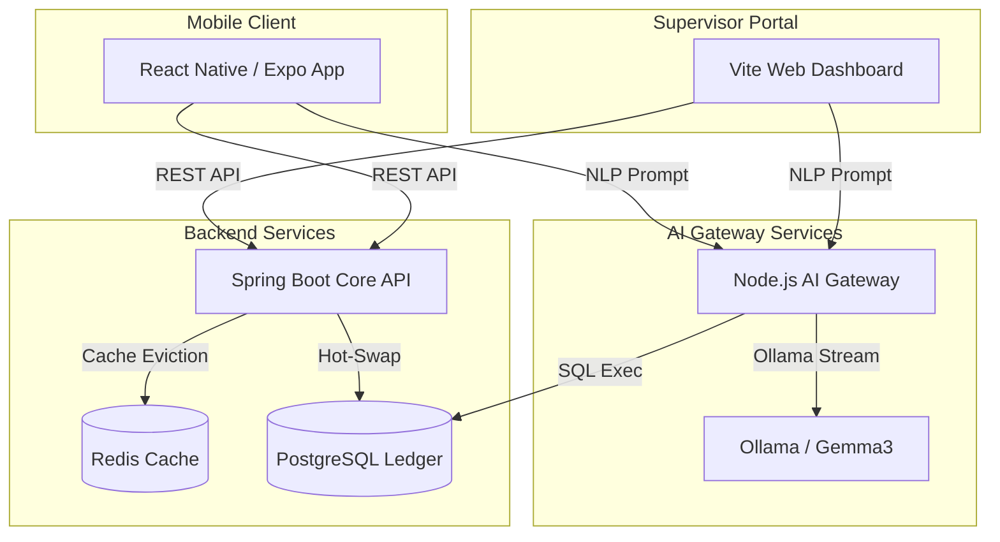

# Assessment Alignment & Evaluation Matrix

Here is how the TankLogix system directly satisfies each of your evaluation metrics:

---

## 1. Requirement Extraction
* **Problem Solved**: Real-time warehouse package routing confirmation and dynamic loading terminal assignment.
* **Extracted Requirements**:
  * **Dynamic Mapping**: Supervisors must be able to assign arriving logistics fleets to physical loading bays dynamically.
  * **Edge Scanning**: Workers need on-device mobile camera scanner scanning to verify package routes.
  * **AI Database Access**: Supervisors need a secure NLP (Natural Language Processing) terminal to query records without writing database queries.
  * **Ledger Resiliency**: Real-time hot-swapping of local storage to cloud failovers.

---

## 2. Approach to Problem
* **Dynamic Design**: Rather than hardcoding configurations, the app utilizes database-driven registries. Adding a truck or a loading bay dynamically synchronizes selectors across both the Web Portal and the Mobile Client.
* **Resilient Connectivity**: Solved the Wi-Fi local connection blocker using real subnet IP bindings so the mobile client communicates seamlessly with the local Docker Compose cluster.
* **Database Swapping**: Solved HikariCP static field locks by building a custom `DynamicDataSource` delegate bean, allowing credential swaps without server restarts.

---

## 3. System Architecture
A modular, containerized multi-tier microservices stack:




---

## 4. AI Model Selection / Computer Vision
* **Computer Vision (On-Device OCR/Barcodes)**: Implemented using `expo-camera` (`CameraView`) on mobile. The app performs local camera stream decoding to parse package identifiers instantly.
* **LLM Selection (Gemma3)**: Utilized Ollama hosting **Gemma3**. It is selected for its high reasoning efficiency and structured output formatting under low-compute local environments.
* **SQL Guard Rails**: The Node.js gateway performs query parsing and regex validation (`sql.replace(...)`) before sending SQL to the Postgres database, preventing SQL injection during the LLM translation process.

---

## 5. Inference Logic
* **Logistics Verification Inference**: The backend verification logic handles multiple route safety states:
  * `VALID`: Route confirmed. Proceed into vehicle.
  * `MISMATCH`: Critical route deviation alert. Shows expected truck.
  * `DUPLICATE`: Double-scan detection (already processed).
  * `NO_TRUCK_DOCKED`: Safeguard warning if the bay is idle.
* **Natural Language to SQL Translation**: The system parses unstructured prompts like *"Who is the driver of the truck at bay door 1?"* into structured PostgreSQL syntax:
  ```sql
  SELECT driver_name FROM truck_inventory JOIN bay_door_routing ON ...
  ```

---

## 6. Implementation
* **Clean Code & Practices**:
  * **Backend**: Java Spring Boot utilizing JPA Repositories, Scheduled Cron operations for cold-data archiving, and custom datasource routing beans.
  * **Web Frontend**: Modern, dark-themed responsive dashboard using curated HSL color accents, glassmorphic card widgets, and state synchronization.
  * **Mobile App**: Paged ScrollView tabs, Expo picker binds, and smooth micro-animations.
