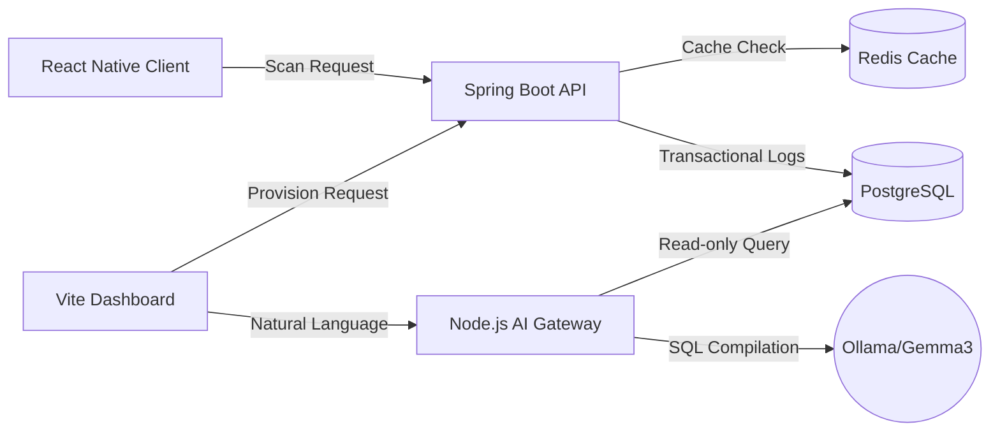

# Presentation Slide Deck: TankLogix Smart Dispatch System

This slide deck maps directly to your presentation requirements. Each slide includes **Slide Content** (bullet points to put on the slides) and **Presenter Notes** (what you should say out loud to the interviewers).

---

## Slide 1: Solution Approach
> **Theme**: Bridging the Gap Between Edge Actions and Cloud Ledger Control

### Slide Content
* **The Problem**: Human errors during manual route checks lead to wrong dispatches, resulting in customer complaints and logistics losses.
* **Our Solution**: **TankLogix Mobile Gateway** – An automated routing verification system.
* **Handheld Edge Scanning**: Workers use smartphones near the loading area to scan package QR codes at the bay doors.
* **Real-time Verification**: Outbound packages are matched against the docked truck's dynamic route mapping instantly before loading.
* **Simple & Error-Proof**: Color-coded feedback (Green/Red) eliminates human cognitive checks during busy periods.

### Presenter Notes
> *"Good morning. Today, I'm presenting **TankLogix**, a system designed to solve the critical logistics problem of wrong package dispatches. Instead of relying on manual paper-based logs or worker memory which fail during peak hours, we introduce an edge-assisted handheld verification model. Workers simply point their smartphone camera at a package label. The system handles the routing validation in less than 2 milliseconds, making dispatch checks instant, automated, and error-proof."*

---

## Slide 2: System Architecture Flow
> **Theme**: Containerized Microservices Ecosystem

### Slide Content
* **Client Layer**: 
  * React Native mobile app (on-device Computer Vision camera decoding).
  * React Vite portal (supervisor provisioning and configuration desk).
* **API & Logic Layer**: Spring Boot REST API (manages routing configuration and package manifest validation).
* **Cache & Memory Layer**: Redis cache (RAM storage for high-frequency scan queries).
* **Database Layer**: PostgreSQL (relational ledger storing manifests, configurations, and logs).
* **AI Engine**: Node.js AI Access Gateway with local **Ollama/Gemma3** for natural language database querying.

### Presenter Notes
> *"Our architecture is built as a modular containerized stack. We have two frontends: a React Native mobile app used by loaders at the bay doors, and a React Vite dashboard used by supervisors. The backend is powered by Spring Boot, which acts as the coordinator. To handle massive scanning throughput, we use a Redis cache layer on top of a PostgreSQL database. Finally, we've integrated a separate AI Gateway that uses Gemma3 locally to allow supervisors to query the database using standard English."*

---

## Slide 3: Why PostgreSQL?
> **Theme**: Relational Integrity and Schema Safety

### Slide Content
* **Structured Data Model**: Package manifests, fleet inventory, and bay door routings are highly relational.
* **ACID Compliance**: Guarantees transaction safety. A package is either fully `DISPATCHED` or `PENDING`—no intermediate state corruption is possible.
* **Relational Joins**: Allows complex mappings (e.g., joining bay doors, active trucks, and package manifests) with sub-millisecond execution.
* **Industry Standard**: Excellent scaling capabilities, wide cloud support, and strong compatibility with Spring Boot JPA.

### Presenter Notes
> *"We chose PostgreSQL as our main ledger because warehouse transactions require absolute consistency. When a package is loaded, we update its status. Under ACID compliance, this update is guaranteed to succeed fully or fail fully, preventing half-written records. PostgreSQL is also perfect for handling our relational mappings, such as joining which truck is at which bay door and which package belongs inside it."*

---

## Slide 4: AI Data Gateway & On-Premise PostgreSQL Scaling
> **Theme**: Simplifying Access Control and Database Resource Management

### Slide Content
* **Why the AI Access Gateway?**
  * Supervisors are not database administrators; they shouldn't need to write SQL to check inventory.
  * Translates natural language queries (e.g., *"Which truck is docked at Bay 2?"*) into SQL using **Gemma3**.
  * **SQLGuardRails**: Enhances security by enforcing a strict **Read-Only** policy. Blocks `DROP`, `UPDATE`, or `DELETE` commands to protect database records from LLM mistakes.
* **On-Premise Scaling Strategy**
  * Exposing database port `5432` directly is a security risk. The Node.js Gateway acts as a secure proxy.
  * Allows scaling on-premise without expensive cloud server licenses by leveraging local GPU/CPU resources for AI querying.

### Presenter Notes
> *"The AI Data Access Gateway solves a major user-experience problem: warehouse supervisors need quick data insights but rarely know SQL. By running Gemma3 locally via Ollama, they can simply type human questions. To make this production-safe, we built **SQLGuardRails** inside the gateway. It parses the SQL returned by the LLM and blocks any destructive commands like DROP or DELETE, ensuring the AI can only execute read-only SELECT queries. This lets us scale database query access securely on-premise."*

---

## Slide 5: Extra Features Built
> **Theme**: Production-Ready Enhancements

### Slide Content
* **Dynamic Database Settings**: Supervisors can hot-swap the active database connection (Local to Cloud PostgreSQL) at runtime from the UI without server restarts.
* **Refresh Record & Reset Manifest**: A single-click button that clears cached data, archives old dispatches, and resets the manifest for immediate re-testing.
* **Dynamic Master CRUD**: Add or delete bay door routing terminals and fleet trucks dynamically, automatically updating the system dropdown menus.
* **Visual Status Readouts**: Color-coded toasts and text feedback on the mobile device to confirm loading actions instantly.

### Presenter Notes
> *"Beyond basic barcode scanning, we implemented several features that make the application production-ready. First is the Dynamic Database Settings switcher, which lets us hot-swap the datasource from a local container to a cloud database at runtime. We also added full CRUD management for both fleet trucks and loading bays directly on mobile and web, as well as a one-click manifest reset button to clear caches and reset test datasets instantly."*

---

## Slide 6: Technologies Used
> **Theme**: Modern, Robust Software Stack

### Slide Content
* **Mobile Client**: React Native, Expo, `expo-camera` (On-Device Computer Vision).
* **Control Web Dashboard**: React, Vite, Axios, Vanilla CSS.
* **Core API Backend**: Java, Spring Boot, Spring Data JPA, Hibernate, Tomcat.
* **Cache & Storage**: Redis Cache, PostgreSQL Database.
* **AI & SQL Compiler**: Node.js, Express, Ollama API, Google Gemma3 (LLM).
* **Infrastructure**: Docker, Docker Compose, Windows PowerShell.

### Presenter Notes
> *"This slide outlines the technologies powering the project. The mobile scanner is built with React Native and Expo using on-device computer vision for QR decoding. The backend utilizes Spring Boot and Hibernate for core logic, while Redis and Postgres handle storage. The AI gateway is written in Node.js, communicating directly with local Gemma3."*

---

## Slide 7: Hot & Cold Data Swap (Dynamic Tiering)
> **Theme**: Keeping the Database Lean and Fast

### Slide Content
* **The Problem**: Over time, millions of scanned packages slow down index lookups and bloat PostgreSQL disk storage.
* **The Solution**: **Dynamic Data Tiering** scheduler.
* **Hot Storage (PostgreSQL Main Ledger)**: Keeps only active, pending, or recently scanned package manifests. Caches these in **Redis** for fast lookups.
* **Cold Storage (PostgreSQL Archive Ledger)**: Automatically moves older `DISPATCHED` records out of active tables into cold archive tables.
* **Automated Scheduler**: Runs in the background (Spring Boot `@Scheduled` cron job) to clean hot tables, flush old Redis cache keys, and move historical logs to archives.

### Presenter Notes
> *"Finally, let's talk about our database optimization strategy: Hot and Cold Data Swapping. In a busy warehouse, scanning millions of packages would soon slow down the database. We solved this by implementing an automated data tiering scheduler. The hot database only keeps active pending items and recent scans. A Spring Boot cron job runs in the background to automatically move historical 'Dispatched' records into a separate cold archive table. This keeps our active indexes clean and ensures our scanning verification speed never degrades."*
